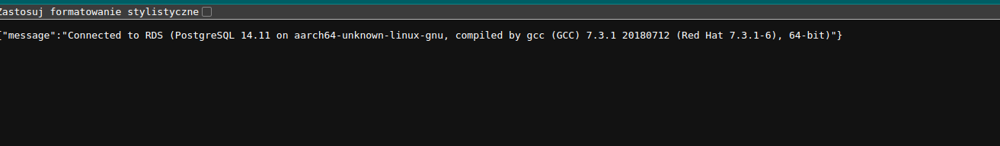

```markdown
# tech-task-ecs

This repository contains Terraform code for deploying an ECS (Elastic Container Service) infrastructure on AWS.

## Project Structure

- `alb.tf` - Configuration for the Application Load Balancer
- `db.tf` - Configuration for the database resources
- `ecs.tf` - Configuration for ECS resources
- `locals.tf` - Local variables
- `outputs.tf` - Output values
- `sg.tf` - Security groups
- `versions.tf` - Terraform version and provider configurations
- `vpc.tf` - Configuration for the VPC

## Prerequisites

- AWS CLI configured with appropriate credentials

## Usage

1. Clone the repository:
   ```sh
   git clone https://github.com/wiszenkoigor/tech-task-ecs.git
   cd tech-task-ecs
   ```

2. Initialize Terraform:
   ```sh
   terraform init
   ```

3. Apply the configuration:
   ```sh
   terraform apply
   ```


## Additional info

**Used application** is a Python RestApi connecting with RDS, pushed to a public ECR repo: (public.ecr.aws/r0g4s2l2/wigor-tech-task:1.0.7)

Application returns a simple info if connection with RDS was successful:



## Outputs

Refer to `outputs.tf` for the values that will be output after applying the Terraform configuration.


## Issues and To-Do


1. **Database Access Restriction**: Access to the database should be restricted to a specific security group, not the entire VPC. This needs to be configured properly in the `db.tf` file.

2. **Resource-Based Policy in Secret Manager**: The current setup includes a resource-based policy for secrets in the Secret Manager. This needs to be either removed or modified.

3. **Manually Created Policy for Secrets**: A policy was manually created for secrets in the Secret Manager. This should be automated using Terraform. Guidance on how to achieve this is required.

4. **IP Range Restrictions:** I will work on adding restricted IP ranges for access tomorrow morning and update the repository accordingly.